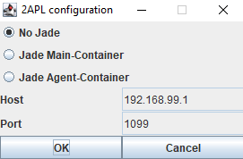
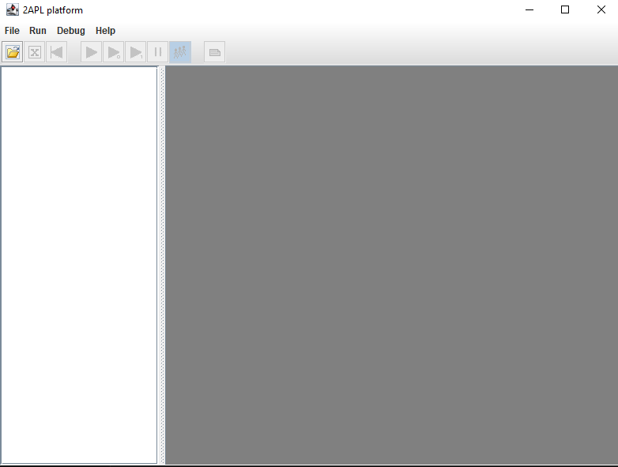
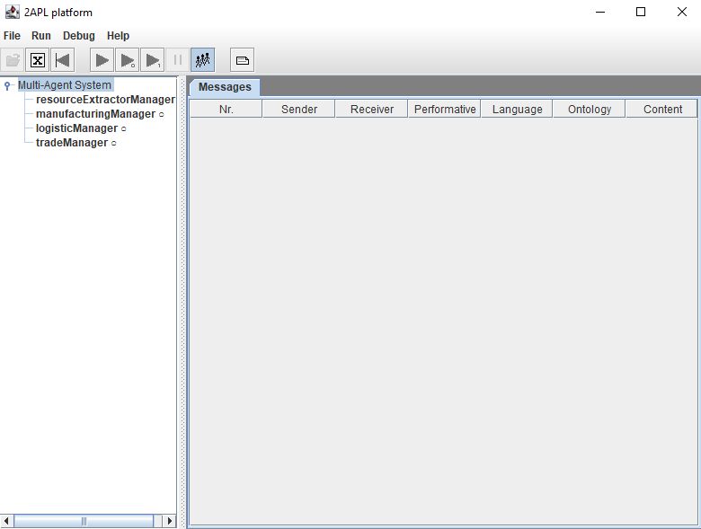

# AlienCorps

## How to Run

1. **Clone the Repository**
   - Clone the repository into your working directory.

2. **Navigate to Your Working Directory**
   - Open your terminal and move to your working directory.

3. **Run the 2APL Platform**
   - Execute the following command in the terminal:
     ```sh
     java -jar 2apl.jar
     ```
   - If the `2apl.jar` file works correctly, you should see the following prompt:

     

4. **Configure 2APL Platform**
   - Select `No Jade` and click `OK`. The output should look like this:

     

5. **Load the MAS**
   - Click on the **Load MAS** icon (the only active icon).
   - Navigate to your working directory and select the `aliens.mas` file in the `src` folder.

     

6. **Run the MAS**
   - If everything has been done correctly, you should see the names of the agents of our MAS on the left side.
   - To run it, click on the **play button**:
     - The first button runs the MAS indefinitely.
     - The second button performs one deliberation cycle.
     - The third button performs one deliberation step.

   - The terminal should now display the log of the environment, printing messages.
